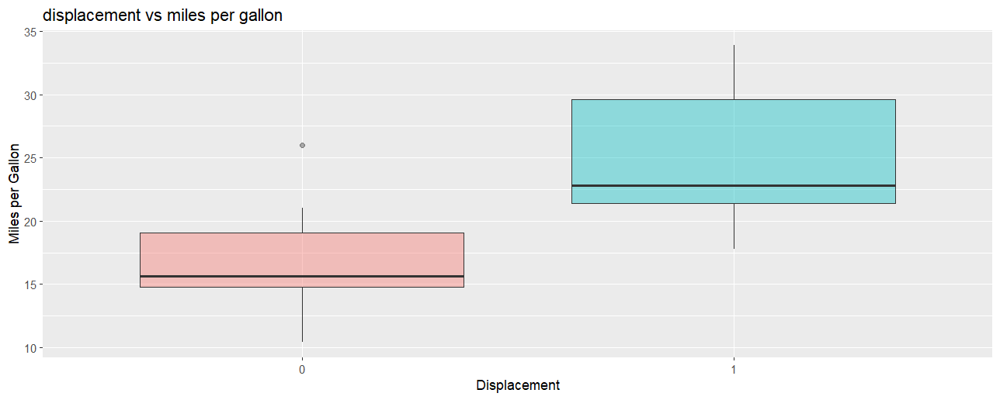

# car analysis Data Exploration 

In this project, I performed an **Exploratory Data Analysis (EDA)** to Compare fuel efficiency between V-shaped and Straight engines.

## 📊 Visual Result

## 🔍 Key Findings
* **Straight engines** (vs=1) are significantly more fuel-efficient than **V-shaped engines** (vs=0)

## 🛠️ Tools Used
* **R Language**
* **ggplot2**
