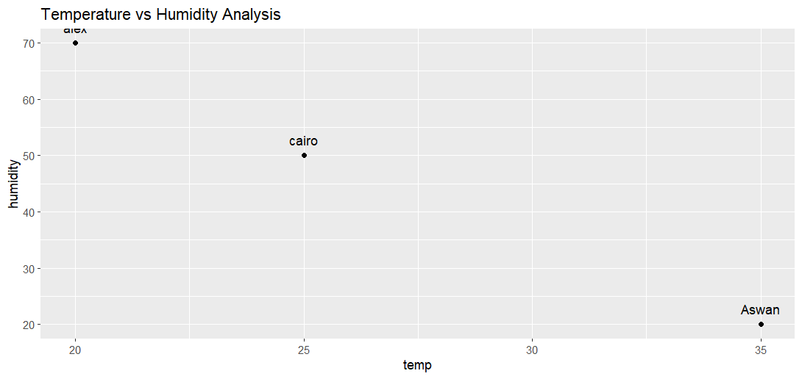

# average temp Data Exploration 

In this project, I performed an **Exploratory Data Analysis (EDA)** to compare between different city temp.

## 📊 Visual Result

## 🔍 Key Findings
* **compare between city temp**
  
## 📉 Analysis Insight: Temperature vs. Humidity
Based on the scatter plot:
* **High Temp / Low Humidity**: Cities like **Aswan** show high temperatures with very low humidity, typical of desert climates.
* **Low Temp / High Humidity**: Coastal cities like **Alex** show lower temperatures but much higher humidity levels.
* **Conclusion**: There is a clear **inverse correlation** between temperature and humidity in this dataset.
## 🛠️ Tools Used
* **R Language**
* **ggplot2**
