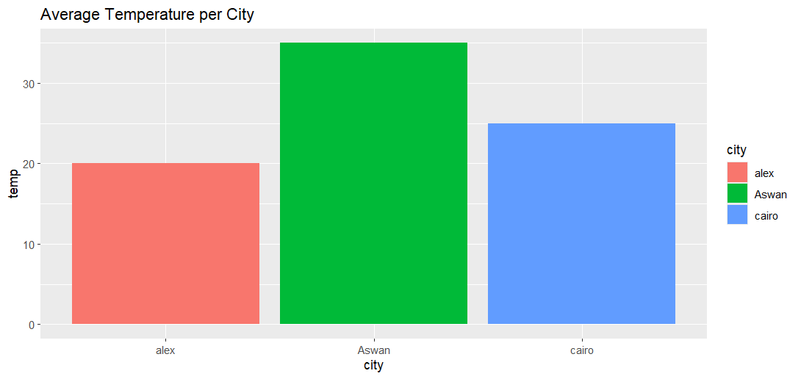

# average temp Data Exploration 

In this project, I performed an **Exploratory Data Analysis (EDA)** to compare between different city temp.

## 📊 Visual Result

## 🔍 Key Findings
* **different between city temp**

## 🛠️ Tools Used
* **R Language**
* **ggplot2**
